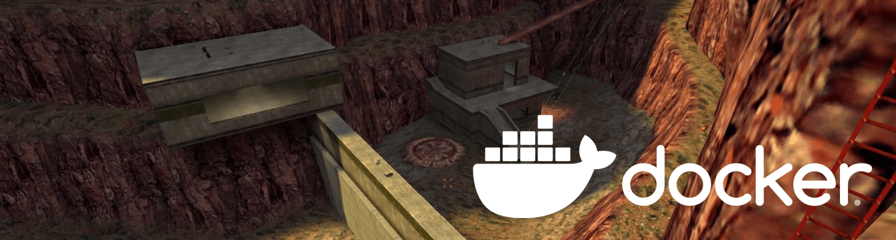

[](https://github.com/artkirienko/hlds-docker-dproto/actions)
[](http://hits.dwyl.com/artkirienko/hlds-docker-dproto)



# HLDS Docker dproto(47/48 Steam+noSteam)

## Half-Life Dedicated Server as a Docker image

Probably the fastest and easiest way to set up an old-school Half-Life
Deathmatch Dedicated Server (HLDS). Both Steam and noSteam, old and new
half-life clients can connect and play together! You don't need to know
anything about Linux or HLDS to start a server. You just need Docker and
this image.

## Quick Start

Start a new server by running:

```bash
docker run -it --rm -d -p27015:27015 -p27015:27015/udp artkirienko/hlds
```

Change the player slot size, map or `rcon_password` by running:

```
docker run -it --rm -d --name hlds -p27015:27015 -p27015:27015/udp artkirienko/hlds +map crossfire +maxplayers 12 +rcon_password SECRET_PASSWORD
```

> **Note:** Any [server config command](http://sr-team.clan.su/K_stat/hlcommandsfull.html)
  can be passed by using `+`. But it has to follow after the image name `artkirienko/hlds`.

## What is included

* [HLDS Build](https://github.com/DevilBoy-eXe/hlds) `7882`. This is the last
  known version that is compatible with last version of **dproto** that's `0.9.582`

  ```
  Protocol version 47/48
  Exe version 1.1.2.2/Stdio (valve)
  Exe build: 17:23:32 May 24 2018 (7882)
  ```

* [Metamod-p](https://github.com/Bots-United/metamod-p) version `1.21p38`

* [AMX Mod X](https://github.com/alliedmodders/amxmodx) version `1.8.2`

* **dproto** version `0.9.582`. This is the last version of **dproto**,
  the project is abandoned.

* [jk_botti](https://github.com/Bots-United/jk_botti) version `1.43`

* Patched list of master servers (official and unofficial master servers
  included), so your game server appear in game server browser of all the clients

* Minimal config present, such as `mp_timelimit` and mapcycle

## Default mapcycle

* crossfire.bsp
* bounce.bsp
* crossfire.bsp
* datacore.bsp
* frenzy.bsp
* gasworks.bsp
* lambda_bunker.bsp
* rapidcore.bsp
* snark_pit.bsp
* stalkyard.bsp
* subtransit.bsp
* undertow.bsp
* boot_camp.bsp

## Advanced

In order to use a custom server config file, add your settings
to `valve/config/server.cfg` of this project and mount the directory as volume
to `/opt/steam/hlds/valve/config` by running:

```bash
docker run -it --rm -d -p27015:27015 -p27015:27015/udp -v $(pwd)/valve/config:/opt/steam/hlds/valve/config artkirienko/hlds
```
